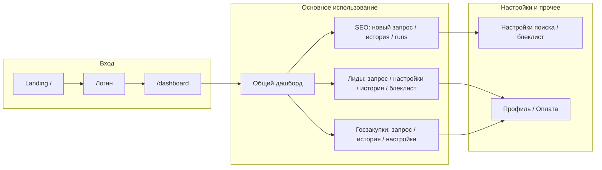

# Полный аудит фронтенда Colaba (SpinLid)

**Дата создания плана:** 2025-03-06

Комплексный аудит фронтенда Colaba (Next.js 14, React 18, TypeScript) по пяти направлениям: структура и маршрутизация, качество кода и API, доступность и UX, функциональность и ошибки, пользовательский workflow и контент. Отчёт основан на исследовании кодовой базы и лучших практиках (Softjourn, Propel, Feature-Sliced Design, WCAG).

Аудит проведён на основе:
- Исследования кодовой базы (маршруты, компоненты, API, формы, конфиги)
- Методик: [Softjourn — How to Audit a Frontend Application](https://softjourn.com/insights/how-to-audit-frontend-app) (структура, производительность, безопасность, документация), [Propel — 17 Critical Frontend Issues](https://propelcode.ai/blog/ai-ux-code-review-checklist-17-critical-frontend-issues) (a11y, производительность, UX-антипаттерны), Feature-Sliced Design (архитектура, читаемость)

---

## 1. Структура кода и маршрутизация

### Плюсы
- Чёткое разделение: `app/` (страницы), `components/`, `lib/`, `src/services/api/`
- TypeScript strict mode включён (frontend/tsconfig.json)
- Path aliases (`@/components/*`, `@/lib/*`, `@/services/*`) упрощают импорты
- Один корневой layout с AppShell и условным AppLayout для авторизованных пользователей

### Проблемы

**Путаница с путём `/app` и папкой `app/app/`**
- Маршруты вида `/app`, `/app/seo`, `/app/leads`, `/app/gos` лежат в `app/app/` (Next.js App Router). Это корректно, но мысленная модель "app внутри app" сбивает с толку при навигации по репозиторию.
- Рекомендация: рассмотреть route group, например `app/(workspace)/`, чтобы URL оставались `/app/...`, а папка не называлась `app`.

**Два понятия "dashboard"**
- **Общий дашборд:** `/dashboard` — одна страница с KPI, графиками, списком запусков по всем модулям. Ссылка в сайдбаре — "Дэшборд".
- **Модульные дашборды:** `/seo/dashboard`, `/leads/dashboard`, `/tenders/dashboard` — используются только при переключении модуля в ModuleContext (`setModule('leads')` → редирект на `/leads/dashboard`). В сайдбаре на них нет ссылок.
- Риск: пользователь не понимает, что "дашборд" может быть общим или модульным; переключатель модулей уводит на другую страницу без явной навигационной связи.

**Сломанные ссылки "Открыть запуск" для лидов и госзакупок**
- В `frontend/app/dashboard/page.tsx` функция `getRunUrl()` ведёт на `/app/leads/results/${id}` и `/app/gos/results/${id}`.
- Маршрутов `app/app/leads/results/[id]/page.tsx` и `app/app/gos/results/[id]/page.tsx` **нет** → переход даёт **404**.
- Для SEO запусков ссылка `/runs/${id}` корректна и существует.

**Редирект после логина**
- middleware.ts: при наличии токена запрос на `/app` редиректит на `/dashboard`. Логин ведёт на `next || '/app'`, поэтому фактически пользователь всегда попадает на `/dashboard`. Страница выбора модуля при авторизации недоступна — это согласовано, но стоит явно зафиксировать в документации или убрать дублирование.

**Чёрный список в двух местах**
- Глобальный: `/settings/blacklist` (в сайдбаре под SEO).
- Лиды: `/app/leads/blacklist`.
- Логика разная (глобальный vs по модулю), но в интерфейсе можно явно подписать "Глобальный блеклист" и "Блеклист лидов", чтобы не путать.

---

## 2. Качество кода, API и обработка ошибок

### Плюсы
- Единый API-клиент с refresh и редиректом на логин при 401 (frontend/client.ts)
- Кеширование: apiCache.ts используется для `listSearches` (TTL 10s) и `getDashboard` (20s) с инвалидацией по префиксу после create/delete
- Типы в lib/types.ts (User, Run, LeadRow, SEOData, IssueCheck и др.) используются по проекту
- Во многих экранах есть loading/error состояния (Dashboard, Runs, ModuleDashboard, RequestMonitorTable, LeadsTable по строкам)

### Критические баги и пробелы

**Ошибки не показываются пользователю**
- **app/runs/[id]/page.tsx:** в `catch` при опросе статуса запуска только перезапускается таймер (`schedule(5000)`), **`setError()` не вызывается** — при падении API пользователь видит пустой/устаревший контент без сообщения об ошибке.
- **app/app/leads/history/page.tsx:** при ошибке `listSearches` вызывается `setRuns([])` без отдельного состояния ошибки — отображается "История пустая" вместо "Ошибка загрузки".
- **app/app/seo/page.tsx** и **app/app/leads/page.tsx:** при ошибке `loadRecent()` только `setRecentRuns([])` — неясно, нет данных или сбой загрузки.
- **app/payment/page.tsx:** запрос планов обрабатывается через `.catch(() => {})` — при ошибке нет ни состояния ошибки, ни сообщения пользователю.

**Несогласованная обработка ошибок**
- Удаление организации: при ошибке показывается `alert()`, тогда как в остальном приложении используются toast или inline-сообщения.

**Дублирование и неиспользуемый код**
- **Два API-клиента:** client.ts (используется, с токенами и refresh) и src/services/api/client.ts (auth в TODO, не используется). Риск ошибочного импорта.
- **search.ts:** корневой search.ts дублирует вызовы поиска без кеша; в приложении используется src/services/api/search.ts.
- **React Query:** установлен, провайдер в Providers.tsx, но **ни одного useQuery/useMutation** — весь data fetching на useState + useEffect + ручной try/catch.
- **Zustand:** в зависимостях, в коде не используется — мёртвая зависимость.

**Загрузка данных**
- Кеш только у search list и dashboard; организации, провайдеры, AI-ассистенты, captcha, монитор — каждый заход даёт новый запрос. Для тяжёлых настроек можно добавить короткий TTL или React Query.

---

## 3. Доступность (a11y) и UX-паттерны

### Плюсы
- Семантика: AppLayout — `<main>`, `<footer>`; Sidebar — `<aside>`, `<nav>`; LeadsTable — `<table>`; формы используют `<form>`.
- ARIA: у сайдбара есть `aria-label` на навигации и кнопке сворачивания; в TopBar/AppHeader — логотип, тема, профиль; в LeadsTable — чекбоксы и кнопки действий с подписями; FAQ — `aria-expanded`; RequestMonitorTable — переключатель с `role="switch"` и `aria-checked`.
- Логин: поля с `<label htmlFor="...">` и `sr-only`.
- Есть loading-состояния (кнопки с Loader2, скелетоны на дашборде, в таблицах).

### Пробелы (по чек-листу Propel / WCAG)

**Формы**
- SearchForm, SearchControls, SearchCard: подписи к полям — только визуальный текст или placeholder, **нет `<label>` с `htmlFor` и `id`** на инпутах/селектах.
- ui/select.tsx: не пробрасывает `id`, поэтому привязка label не сработает без доработки.

**Таблицы**
- В LeadsTable сортировка по заголовкам реализована через `
` с `onClick` — нет семантики кнопки и **нет `aria-sort`**.
- Мобильное меню действий (три точки) в LeadsTable — без `role="menu"`, `aria-haspopup`, `aria-expanded`.

**Выпадающие меню**
- Профиль в TopBar/AppHeader: триггер имеет `aria-expanded`/`aria-haspopup`, но панель — обычный `div` без `role="menu"`.

**Дизайн-система**
- Используются ui/button, ui/input, ui/select. AppErrorBoundary — свой `<button>` и классы; в LeadsTable чекбоксы и мобильное меню — нативные/кастомные элементы без общих компонентов.

**Адаптивность**
- LeadsTable: переключение таблица/карточки по breakpoint.
- Sidebar: ширина переключается (72/260px), но **нет скрытия или drawer на мобильных**.
- SearchControls: фиксированный flex без медиа-запросов — на очень маленьких экранах возможен перенос/переполнение.

**Контраст и фокус**
- В коде есть классы `focus-visible:ring-*`. Отдельной проверки контраста (WCAG 4.5:1) не проводилось — стоит прогнать Lighthouse Accessibility или axe.

---

## 4. Функциональность и работоспособность

### Что работает
- Авторизация: логин, редирект по `next`, защита маршрутов через middleware (access_token cookie).
- Дашборд: загрузка KPI и графиков, ссылки на SEO-запуски (`/runs/[id]`), скелетоны и ошибка с "Повторить".
- SEO: создание поиска, переход на страницу запуска, история запусков, удаление, экспорт CSV.
- Лиды: форма запроса, история, настройки, блеклист; таблица лидов с фильтрами, копирование, добавление в блеклист, запуск SEO-аудита по строке.
- Госзакупки: страница текущего запроса с fetch к API; история и настройки по маршрутам.
- Настройки: провайдеры, AI-ассистенты, captcha, глобальный блеклист — загрузка и сохранение.
- Профиль, оплата (страницы есть), организации и пользователи организаций.
- Тема (светлая/тёмная), тосты, Error Boundary.

### Что сломано или неполно
- **404 при "Открыть" для лидов/госзакупок** с главного дашборда.
- **Ошибки при загрузке** на страницах runs/[id], leads/history, seo/leads recent, payment не показываются.
- **Политика конфиденциальности:** заглушка ("Текст политики конфиденциальности... Здесь будут условия...").
- **Документация устарела:** FRONTEND_MVP_README.md описывает только моки и localStorage; NAVIGATION_GUIDE.md не отражает текущие маршруты.

### Валидация форм
- Логин: `required` на полях, развёрнутая обработка ошибок сети и сервера.
- Регистрация (landing): своя валидация (email, длина пароля, цифра, совпадение паролей).
- Регистрация (app): HTML5 `required`, `minLength={8}`.
- Поиск (SEO/лиды): обязательность ключевого слова не везде явно проверяется перед отправкой.

---

## 5. Пользовательский workflow и контент

### Workflow (логичность и полнота)

- **Вход:** логин с редиректом на `/dashboard` — предсказуемо.
- **Переключение модулей:** в шапке переключатель ведёт на модульный дашборд, основной поток — через сайдбар. Пользователь может не понять разницу между "Дэшборд" в сайдбаре и сменой модуля в шапке.
- **Главный разрыв:** с дашборда "Открыть" для лидов/госзакупок ведёт в 404 — ключевой сценарий "посмотреть результат" для двух из трёх модулей не работает.

### Контент
- Интерфейс на русском — единообразно.
- Страница политики — заглушка; для продакшена нужен юридический текст.
- README и NAVIGATION_GUIDE не соответствуют текущему состоянию.

### Безопасность (кратко)
- Нет использования `dangerouslySetInnerHTML`/`eval` в коде.
- Токены: httpOnly cookie и прокси; клиент не хранит access в localStorage — ок.
- Публичные пути в middleware ограничены `/auth/login`, `/auth/register`; корень `/` доступен без авторизации.

### Производительность
- Next.js 14, SWC minify; в next.config заданы форматы изображений (avif, webp), в коде почти нет использования `next/image`. При появлении контентных картинок стоит подключать `next/image` и lazy loading.
- React Query не используется — нет единого кеша и дедупликации запросов.
- Отдельного замера Core Web Vitals не было — целесообразно прогнать Lighthouse после исправления критичных багов.

---

## Сводная таблица приоритетов

| Приоритет | Категория | Проблема | Действие |
|-----------|-----------|----------|----------|
| Критично | Маршруты | 404 при переходе на результаты лидов/госзакупок с дашборда | Добавить страницы results для leads/gos или изменить ссылки на существующие |
| Критично | Ошибки | runs/[id], leads/history, seo/leads recent, payment не показывают ошибку пользователю | Ввести/выводить состояние ошибки и кнопку "Повторить" где нужно |
| Высокий | Ошибки | payment: пустой catch при загрузке планов | Показать ошибку и при необходимости retry |
| Высокий | Ошибки | organizations delete через alert() | Заменить на toast или inline-сообщение |
| Высокий | API | Два клиента и дубли search.ts | Оставить один клиент, один модуль поиска; удалить или пометить deprecated неиспользуемое |
| Средний | A11y | Формы поиска без label+id | Добавить скрытые/видимые label и id на инпуты/селекты |
| Средний | A11y | Сортировка в таблице — не button, нет aria-sort | Заменить на `<button>` и aria-sort |
| Средний | UX | Модульные дашборды не видны в навигации | Либо добавить пункты в сайдбар, либо убрать переключатель модулей с редиректом |
| Средний | Документация | README и NAVIGATION_GUIDE устарели | Обновить под текущие маршруты и реальный API |
| Низкий | Контент | Политика конфиденциальности — заглушка | Добавить полный текст |
| Низкий | Зависимости | React Query и Zustand не используются | Либо внедрить React Query для server state, либо убрать из зависимостей; то же для Zustand |
| Низкий | Адаптив | Сайдбар на мобильных не сворачивается в drawer | Рассмотреть скрытие/overlay на малых экранах |

---

## Рекомендуемый порядок работ

1. **Исправить 404:** реализовать страницы результатов лидов/госзакупок или перенаправить ссылки с дашборда на существующие экраны.
2. **Единообразно показывать ошибки загрузки** на runs/[id], leads/history, seo/leads (recent), payment и добавить retry где уместно.
3. **Унифицировать обработку ошибок** (удаление организации и др.) через toast или общий паттерн.
4. **Привести API к одному клиенту** и одному модулю поиска; убрать неиспользуемый код и, при необходимости, неиспользуемые зависимости.
5. **Улучшить a11y:** label+id для форм поиска, кнопки сортировки с aria-sort, при необходимости — доработка выпадающих меню и мобильного меню в LeadsTable.
6. **Обновить документацию** (README, NAVIGATION_GUIDE) и контент политики конфиденциальности.
7. **По желанию:** внедрить React Query для основных списков/дашборда и провести замер производительности (Lighthouse, Core Web Vitals).
